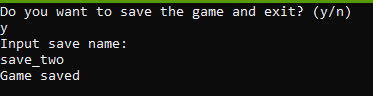
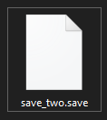
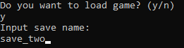
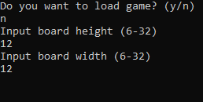
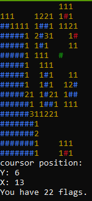
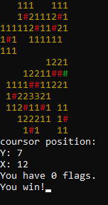
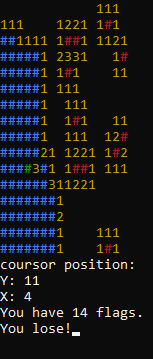

# **Saper**

** ENGLISH TRANSLATION BELOW **

Projekt został napisany w języku C++. Program pozwala użytkownikowi grać w Sapera (w systemie Windows) poprzez odkrywanie kafelków, unikanie bomb i używanie flag do oznaczania potencjalnych lokalizacji bomb.
Stan gry i plansza są aktualizowane na podstawie danych wprowadzonych przez użytkownika, a gracz może zapisywać i wychodzić z gry lub ją wczytywać.

**Sterowanie**

 Klawisze używane do gry to:
 - klawisze strzałek - do poruszania kursorem po planszy
 - prawy shift - do odsłaniania kafelków
 - prawy control - do oznaczania kafelków (flagowanie kafelka uniemożliwia jego odkrycie)
 - znak zapytania - używany do zapisywania stanu gry

**Zapis i ładowanie gry**

Użytkownik może w każdym momencie wyjść z gry i zapisać swój postęp/stan planszy pod jakąś nazwą. Powstaje wtedy plik .save, który możemy wczytać, wpisując nazwę, na początku gry.

**Generowanie planszy**

Użytkownik, przy każdej grze wybiera wysokość i szerokość planszy, wymiary mogą wynosić od 6 do 32. Na podstawie wpisanych danych jest ustawiana ilość bomb do odnalezienia. 

**Gameplay**

Program wyświetla planszę zbudowaną z "#", możemy się po niej swobodnie poruszać, sprawdzać pola i oznaczać potencjalne bomby flagami. Pod planszą wyświetla się pozycja kursora (cousor position), koordynaty (Y: - wysokość, X: - szerokość), oraz ilość pozostałych flag/bomb. 

W przypadku wygranej, która następuje po odkryciu wszystkich pól nie będących bombami oraz oflagowaniu wszystkich bomb jest wyświetlany komunikat "You win!", w przypadku przegranej "You lose!".

**Kod**

Cały kod został zakomentowany i dogłębnie wytłumaczony w pliku .cpp. Kod zawiera m.in. struct, wiele funkcji czy obsługę plików.

**Biblioteki**

\<string>     Udostępnia funkcje i klasy służące do manipulowania zmiennymi string

\<cmath>      Udostępnia funkcje i operacje matematyczne

\<ctime>      Udostępnia funkcje do pracy z czasem i datą

\<cstdlib>    Zapewnia ogólne potrzebne funkcje (np. alokacja pamięci, generowanie liczb)

\<fstream>    Udostępnia operacje wejścia/wyjścia pliku, strumieniowa obsługa plików

\<Windows.h>  Zapewnia funkcjonalność specyficzną dla systemu Windows

**Podsumowanie**

Projekt spełnia swój cel - gra w Saper działa. Spełnione są również minimalne wymagania techniczne projektu.

# **Minesweeper**
The project is written in C++. The program allows the user to play Minesweeper (on Windows) by uncovering tiles, avoiding bombs, and using flags to mark potential bomb locations. The game state and board are updated based on user input, and the player can save and load the game.

**Controls**

The keys used for the game are:

Arrow keys - to move the cursor on the board
Right Shift - to uncover tiles
Right Control - to flag tiles (flagging a tile prevents it from being uncovered)
Question mark - used to save the game state
Save and load game

The user can exit the game at any time and save their progress/board state under a specific name. This creates a .save file that can be loaded at the beginning of the game by entering its name.

**Generating the board**

The user chooses the height and width of the board at the start of each game, with dimensions ranging from 6 to 32. Based on the entered data, the number of bombs to be found is set.

**Gameplay**

The program displays a board constructed with "#", and the player can freely move on it, check fields, and mark potential bombs with flags. Below the board, the cursor position (cursor position), coordinates (Y: - height, X: - width), and the remaining number of flags/bombs are displayed.

In case of winning, which occurs after uncovering all non-bomb tiles and flagging all bombs, the message "You win!" is displayed. In case of losing, the message "You lose!" is displayed.

**Code**

The entire code is commented and thoroughly explained in the .cpp file. The code includes a struct, multiple functions, and file handling.

**Libraries**

<string> Provides functions and classes for manipulating string variables.

<cmath> Provides mathematical functions and operations.

<ctime> Provides functions for working with time and date.

<cstdlib> Provides general-purpose functions (e.g., memory allocation, random number generation).

<fstream> Provides file input/output operations, stream-based file handling.

<Windows.h> Provides Windows-specific functionality.

**Summary**

The project fulfills its purpose - the Minesweeper game works. The minimum technical requirements of the project are also met.
