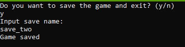
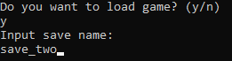
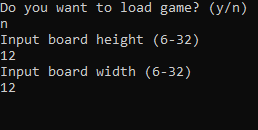
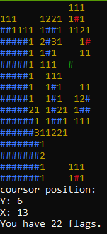

# **SAPER**
Projekt został napisany w języku C++. Program pozwala użytkownikowi grać w Sapera (w systemie Windows) poprzez odkrywanie kafelków, unikanie bomb i używanie flag do oznaczania potencjalnych lokalizacji bomb.
Stan gry i plansza są aktualizowane na podstawie danych wprowadzonych przez użytkownika, a gracz może zapisywać i wychodzić z gry lub ją wczytywać.

**Sterowanie**
 Klawisze używane do gry to:
 - klawisze strzałek - do poruszania kursorem po planszy
 - prawy shift - do odsłaniania kafelków
 - prawy control - do oznaczania kafelków (flagowanie kafelka uniemożliwia jego odkrycie)
 - znak zapytania - używany do zapisywania stanu gry

**Zapis i ładowanie gry**
Użytkownik może w każdym momencie wyjść z gry i zapisać swój postęp/stan planszy pod jakąś nazwą. Powstaje wtedy plik .save, który możemy wczytać, wpisując nazwę, na początku gry.

**Generowanie planszy**
Użytkownik, przy każdej grze wybiera wysokość i szerokość planszy, wymiary mogą wynosić od 6 do 32. Na podstawie wpisanych danych jest ustawiana ilość bomb do odnalezienia. 

**Gameplay**
Program wyświetla planszę zbudowaną z "#", możemy się po niej swobodnie poruszać, sprawdzać pola i oznaczać potencjalne bomby flagami. Pod planszą wyświetla się pozycja kursora (cousor position), koordynaty (Y: - wysokość, X: - szerokość), oraz ilość pozostałych flag/bomb. 

W przypadku wygranej, która następuje po odkryciu wszystkich pól nie będących bombami oraz oflagowaniu wszystkich bomb jest wyświetlany komunikat "You win!", w przypadku przegranej "You lose!".

**Kod**
Cały kod został zakomentowany i dogłębnie wytłumaczony w pliku .cpp. Kod zawiera m.in. struct, wiele funkcji czy obsługę plików.

**Biblioteki**
<string>     Udostępnia funkcje i klasy służące do manipulowania zmiennymi string
<cmath>      Udostępnia funkcje i operacje matematyczne
<ctime>      Udostępnia funkcje do pracy z czasem i datą
<cstdlib>    Zapewnia ogólne potrzebne funkcje (np. alokacja pamięci, generowanie liczb)
<fstream>    Udostępnia operacje wejścia/wyjścia pliku, strumieniowa obsługa plików
<Windows.h>  Zapewnia funkcjonalność specyficzną dla systemu Windows

**Podsumowanie**
Projekt spełnia swój cel - gra w Saper działa. Spełnione są również minimalne wymagania techniczne projektu.